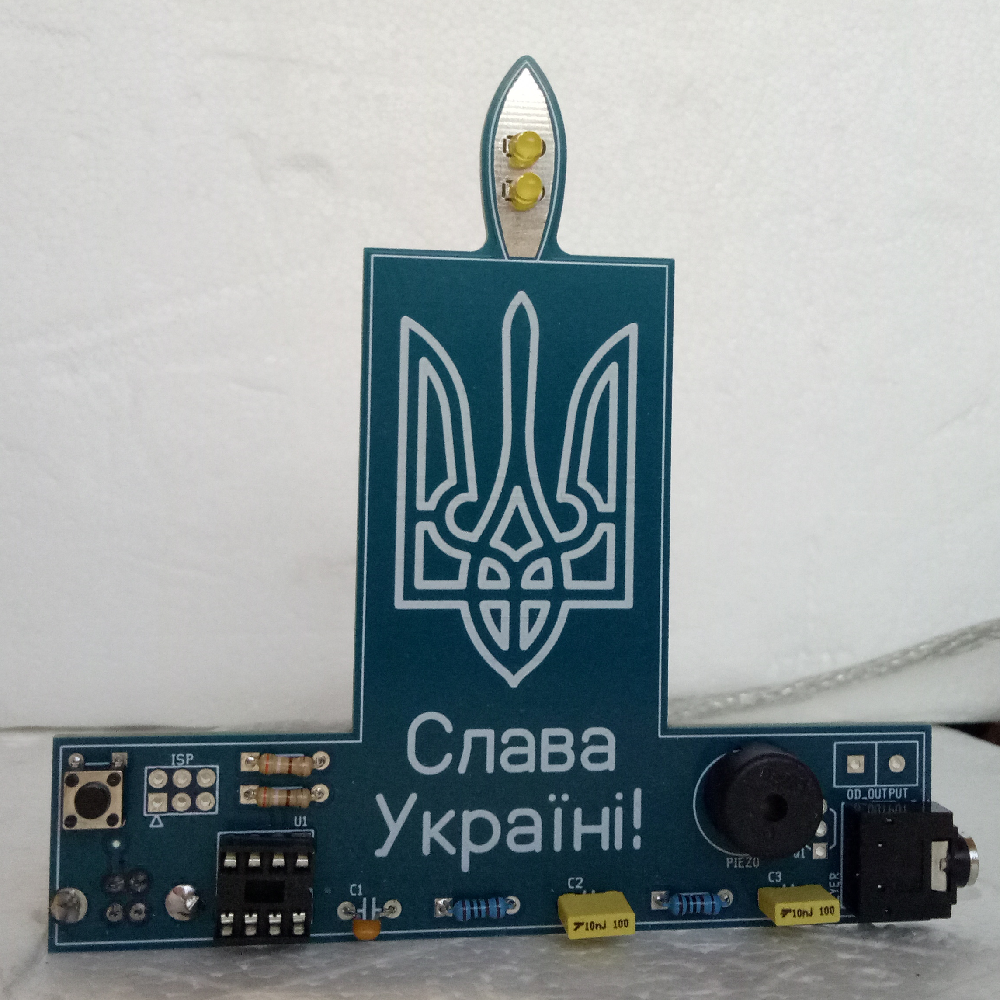
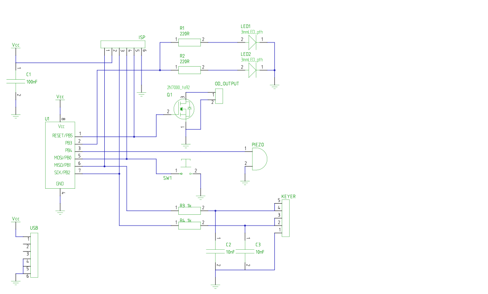

# STEM4ukraine-Candle-Keyer

A simple PCB with an animated candle flicker, iambic Morse keyer, and sound effects set off by pressing of the button!

An ideal school STEM project demonstrating use of GPIO for detecting button presses and paddles with software debouncing, pseudorandom sequences on LEDs to mimic flickering, learning about Morse code, and playing musical tones on the piezo speaker.

Celebrate Ukraine while you key in Morse code, or play the Ukrainian national anthem on the built in speaker!

The front of the PCB

The schematic:

Bill of materials:

- U1: attiny13
- C1: 100nF
- C2, C3: 10nF
- R1,R2: 220R
- R3,R4: 1k
- LED1,LED2: yellow 3mm LED
- SW1: momentary switch
- PIEZO: piezo speaker
- KEYER: stereo 3.5mm phono socket for iambic keyer input
- USB1: 180 degree vertical through hole type B USB socket
- Q1: optional, open drain output mosfet, requires RESET pin to be disabled in firmware
- OD_OUTPUT: optional, if Q1 installed, 5.08mm header for external keying line with suitable firmware modifications
